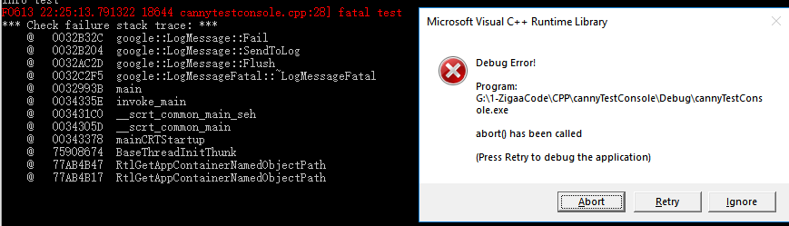

-----------------------------------------------------------------------------------------------------------------------------------

Log information is nessceary for developing work. As an characteristic of tools, they should be easy to use and should not take too many extra time, so this lib is established.

The first log lib is glog.
- [glog](https://github.com/google/glog)

